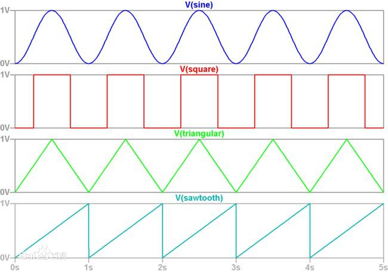

# 音频API

## 音频上下文

new AudioContext()

创建一个音频上下文（audioContext），上下文自动启动，不可停止

- 方法：createOscillator

返回一个音频振荡器对象（OscillatorNode），通过该对象，可以控制声音的波形（音色）和频率（音高）；并且，该对象可以用于将声音叠加到上下文中的某个时间点，发出声音。

- 方法：createGain

返回一个音量控制对象(GainNode)，通过该对象，可以控制音频的总音量。

- 属性：currentTime，获取当前上下文已播放的总时间，单位秒

## 振荡器OscillatorNode

- 方法：connect(GainNode对象)

将振荡器连接到音量控制器，不连接不可发声

- 属性 type

四个取值：

1) sine：默认值，正弦波形
2) square：方形波
3) sawtooth：锯齿波
4) triangle：三角波

- 属性 frequency.value

获取和设置振荡频率，频率越高，声音越高

按照第一国际音高，标准中音6的频率为：440HZ

以下是按照第一国际音高，从低音1，到高音7的频率(未包含小数)
[130, 147, 165, 175, 196, 220, 246, 262, 294, 330, 349, 392, 440, 494, 523, 587, 659, 698, 784, 880, 988, 1047]

- 方法 start(音频上下文时间)

在指定的音频上下文时间开始播放声音

- 方法 stop(音频上下文时间)

在指定的音频上下文时间停止播放

## 音量控制对象 GainNode

- 方法 connect(audioContext.destination)

将声音连接到指定的设备，这里直接连接到上下文的默认扬声器

- 属性 gain.value 

设置音量 0 ~ 1

- 方法 gain.linearRampToValueAtTime(目标音量, 变化截至时间)

将当前音量逐步变化到目标音量，时间跨度为当前时间 - 变化截至时间，**线性变化**

- 方法 gain.exponentialRampToValueAtTime(目标音量, 变化截至时间)

将当前音量逐步变化到目标音量，时间跨度为当前时间 - 变化截至时间，**指数变化**